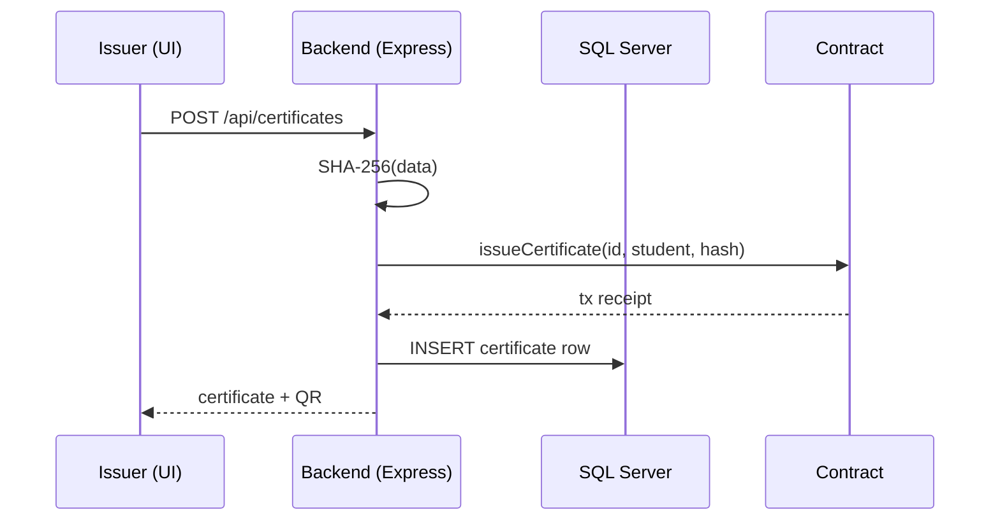
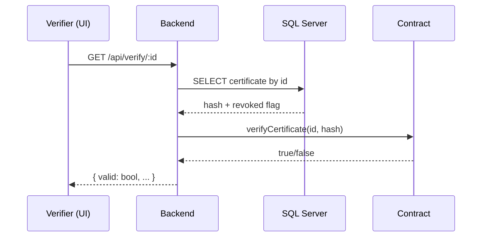

# Diagrams

## Sequence: Issue Certificate

```mermaid
sequenceDiagram
  participant U as Issuer (UI)
  participant B as Backend (Express)
  participant DB as SQL Server
  participant C as Contract

  U->>B: POST /api/certificates
  B->>B: SHA-256(data)
  B->>C: issueCertificate(id, student, hash)
  C-->>B: tx receipt
  B->>DB: INSERT certificate row
  B-->>U: certificate + QR
```

## Sequence: Verify Certificate

```mermaid
sequenceDiagram
  participant U as Verifier (UI)
  participant B as Backend
  participant DB as SQL Server
  participant C as Contract

  U->>B: GET /api/verify/:id
  B->>DB: SELECT certificate by id
  DB-->>B: hash + revoked flag
  B->>C: verifyCertificate(id, hash)
  C-->>B: true/false
  B-->>U: { valid: bool, ... }
```
